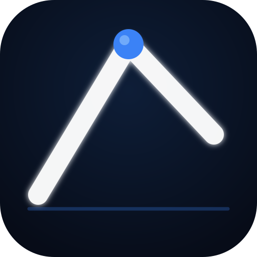
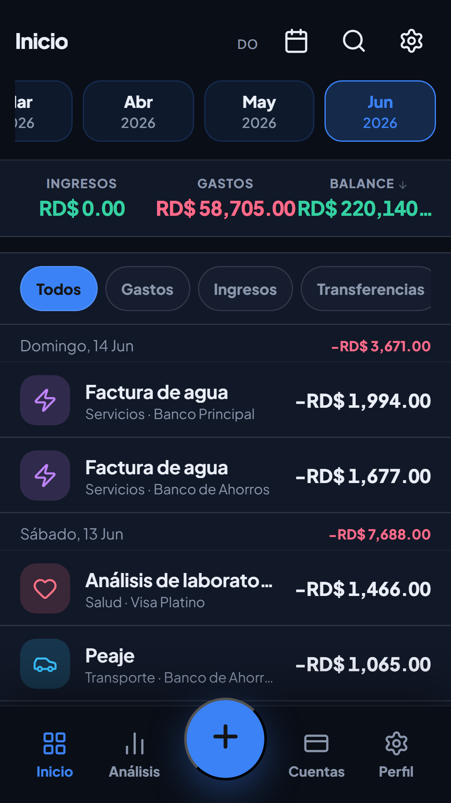
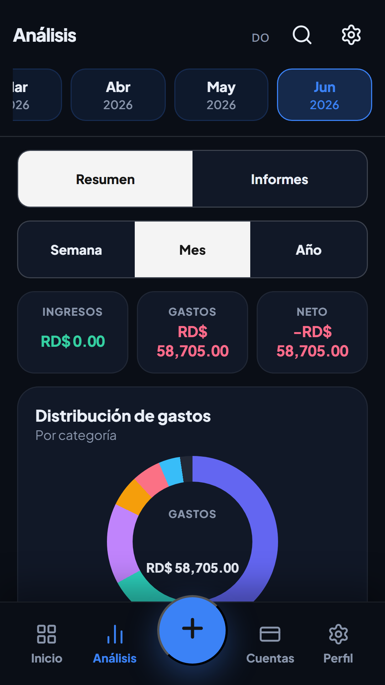
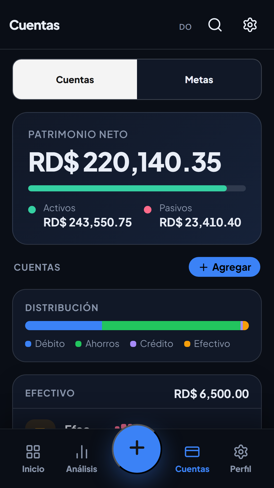
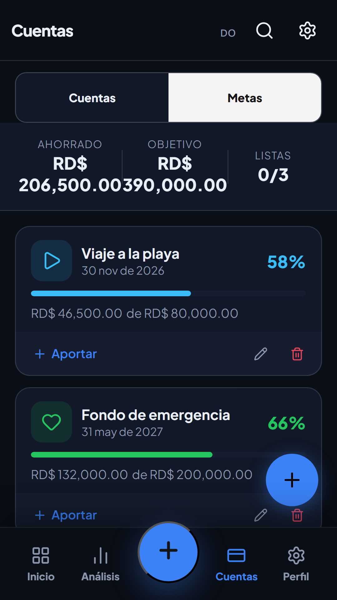
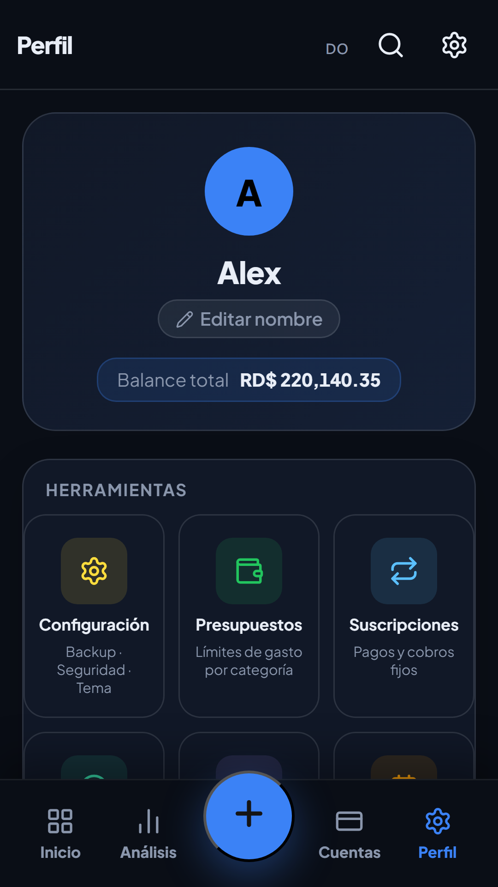

<div align="center">



# $harky

**Finanzas personales para República Dominicana, sin depender de una hoja de Excel.**


[Descargar](#instalación) · [Funcionalidades](#qué-puedes-hacer-con-harky) · [Capturas](#así-se-ve) · [Desarrollo](#empezar-a-desarrollar) · [Roadmap](ROADMAP.md)

</div>

---

## Por qué existe

Casi todas las apps de finanzas personales que llegan a República Dominicana están pensadas para otro país: no reconocen los bancos locales, muestran todo en dólares por defecto y nadie les enseña a leer un estado de cuenta de Banreservas o del Popular. $harky nació de la frustración de llevar las cuentas en una hoja de cálculo que se desactualizaba cada dos semanas.

Es una app mobile-first — pensada primero para tu teléfono, no para un dashboard de escritorio — que registra tus movimientos, entiende tus presupuestos, te avisa cuando algo se sale de lo normal y no necesita internet para funcionar. La sincronización en la nube existe, pero es opcional: tus datos viven en tu dispositivo primero.

## Así se ve

<table>
<tr>
<td></td>
<td></td>
<td></td>
<td></td>
<td></td>
</tr>
<tr>
<td align="center"><sub>Inicio</sub></td>
<td align="center"><sub>Análisis</sub></td>
<td align="center"><sub>Cuentas</sub></td>
<td align="center"><sub>Metas</sub></td>
<td align="center"><sub>Perfil</sub></td>
</tr>
</table>

## Qué puedes hacer con $harky

### Registrar y entender tu dinero

Cada movimiento se anota como ingreso, gasto o transferencia, con categoría, cuenta y — si quieres — fotos del recibo. Cuando una compra cubre varias cosas (el súper de la semana, por ejemplo), puedes **dividirla entre categorías** en lugar de forzarla en una sola. La app también aprende: si sigues categorizando "Uber" como Transporte, la próxima vez te lo sugiere sola.

### Cuentas de verdad, en la moneda que uses

Efectivo, débito, ahorro y tarjetas de crédito, cada una con su color, su política de sobregiro y — si tienes una cuenta en dólares mientras el resto está en pesos — **su propia divisa**. Los totales se convierten automáticamente con tasas de cambio en vivo, y si necesitas hacer una conversión rápida sin tocar tus cuentas, hay una calculadora de divisas integrada con las 9 monedas que soporta la app.

### Presupuestos que no se resetean a lo tonto

Presupuesto mensual por categoría, con la opción de que el sobrante (o el exceso) de un mes se traslade al siguiente — el famoso *rollover* que casi ninguna app hace bien. Alertas cuando vas cruzando el 80% y el 100%, configurable por categoría.

### Metas de ahorro con aportes automáticos

Defines cuánto necesitas, para cuándo, y desde qué cuenta quieres que salga el aporte periódico. La app lo hace sola, sin que tengas que acordarte cada quincena.

### Suscripciones y flujo de caja proyectado

Un catálogo de más de 40 servicios (Netflix, Spotify, gimnasios, seguros...) para llevar tus pagos fijos con pausa y salto de ciclos. Y para responder la pregunta que realmente importa — *¿me alcanza hasta fin de mes?* — hay un calendario de **flujo de caja proyectado** que combina tus recurrencias, suscripciones y aportes a metas para mostrarte el saldo día por día, con aviso si vas a quedar en negativo antes de que pase.

### Inteligencia financiera con acciones, no solo gráficas

$harky detecta anomalías de gasto, tendencias por categoría y patrones que ni tú habías notado — como un cargo recurrente que nunca marcaste como suscripción. Cada hallazgo viene con un botón de acción directa: ajustar el presupuesto, convertir el gasto en recurrente, etc. No es un reporte bonito que archivas y olvidas.

### Simulador de deudas

Si tienes varias deudas, compara las estrategias *avalanche* (primero la de mayor interés) y *snowball* (primero la más pequeña) y te muestra cuánto te ahorras en intereses y meses según cuál elijas.

### Importación bancaria dominicana

CSV de Banco Popular, BHD, Banreservas y Scotiabank, con detección automática de columnas, vista previa antes de confirmar y deduplicación por fecha/monto/nota. En Android, la app también puede leer las **notificaciones bancarias** de tu teléfono y convertirlas en movimientos sin que tengas que tocar nada.

### Reportes que se pueden compartir de verdad

PDF mensual con resumen ejecutivo, Excel con hojas separadas por mes/categoría/cuenta, CSV y capturas PNG de las gráficas. La pestaña de Informes muestra un desglose real de tus categorías top del mes, no un menú de atajos.

### Recibos escaneados

Toma una foto de un recibo y la app extrae el monto con OCR — reconocimiento en el propio dispositivo en Android (ML Kit), y en el navegador como respaldo.

### Tus datos, respaldados de varias formas

Backup manual en JSON, backup automático semanal a una carpeta dedicada en tu teléfono, snapshots de recuperación locales, y respaldo en la nube opcional vía Supabase si activas sincronización.

### Seguridad sin fricción

PIN, patrón o huella/rostro para abrir la app, cifrados en el Keystore de Android — nunca en texto plano. La app no te lo pide de entrada: te deja registrar tus primeros movimientos, y solo entonces te sugiere protegerla.

### El resto de los detalles

- Widget de balance en la pantalla de inicio de Android.
- Recordatorios locales y notificaciones de presupuesto/pagos próximos.
- Accesos directos desde el ícono (mantener presionado para agregar un gasto sin abrir la app).
- Temas oscuro, claro, AMOLED y automático según el sistema.
- Español e inglés completos, con auto-detección del idioma del teléfono.
- Búsqueda global de transacciones, cuentas y metas.

## Plataformas

$harky no es una sola app — es el mismo código corriendo en tres sitios:

| Plataforma | Cómo se instala | Motor |
|---|---|---|
| **Android** | APK / Play Store | Tauri 2 nativo |
| **Web (PWA)** | "Agregar a pantalla de inicio" desde el navegador | Vite + vite-plugin-pwa |
| **Windows** | Instalador `.exe` o versión portable | Tauri 2 desktop |

Las funciones que dependen del hardware del teléfono (OCR nativo, notificaciones bancarias, widget, biometría) solo están disponibles en Android — en la PWA y en Windows tienes el resto de la app completa.

## Stack técnico

| Capa | Tecnología |
|---|---|
| Frontend | React 18 + TypeScript (strict) |
| Bundler | Vite 6 |
| Estado | Zustand 5 |
| App nativa | Tauri 2 (Rust) — Android y Windows |
| Backend cloud | Supabase (auth, sync en tiempo real, storage) |
| Gráficas | Recharts |
| Exportación | jsPDF, ExcelJS, html2canvas |
| OCR | ML Kit (Android) / Tesseract.js (web) |
| Tests | Vitest (unitarios) + Playwright (E2E) |

## Arquitectura

```text
src/
  mobile/          Toda la UI mobile-first (30+ pantallas y sheets)
  store/           Zustand — finanzas, ajustes, auth, deudas
  data/            Cálculos, import/export, backup, inteligencia financiera
  hooks/           Automatizaciones (recurrencias, backups, notificaciones)
  lib/             Integraciones (Supabase, OCR, biometría, notificaciones)
  i18n/            Diccionarios ES/EN
  styles/          CSS modular por sección

src-tauri/
  src/lib.rs       Backend Rust: archivos, keyring, recibos compartidos
  tauri.conf.json  Configuración nativa (Android + Windows)

docs/
  index.html       Landing pública (GitHub Pages)
  ANDROID.md        Guía de build Android
  RELEASE.md        Proceso de release
```

## Empezar a desarrollar

Necesitas Node.js 20+, npm y, si vas a compilar la app nativa, Rust estable con las dependencias de Tauri para tu sistema operativo.

```bash
npm install
cp .env.example .env.local   # configura Supabase solo si vas a probar cloud sync
npm run dev                  # servidor web en localhost:3000
npm run tauri:dev            # versión desktop nativa
```

### Validar cambios

```bash
npm run lint
npm run test          # 100 tests con Vitest
npm run build          # tsc -b && vite build
npm run test:e2e        # Playwright
cargo check --manifest-path src-tauri/Cargo.toml
```

### Compilar para Android

```bash
npm run package:android -- -Debug -Target aarch64
adb install -r release/android/$harky-android-debug-universal.apk
```

Guía completa en [docs/ANDROID.md](docs/ANDROID.md).

### Compilar para Windows

```bash
npm run package:windows
```

Genera `release/windows/$harky-setup.exe` (instalador) y `$harky-portable.exe`. La carpeta `release/` no se versiona — los binarios se publican en [GitHub Releases](https://github.com/XsharklinX/Sharky-Coin/releases).

## Seguridad y privacidad

- **Local-first de verdad**: la app funciona completa sin conexión. La nube es un extra, no un requisito.
- El PIN y el patrón se cifran con el Keystore de Android (o el keyring del sistema en desktop) — nunca se guardan en texto plano.
- La sincronización cloud usa Row Level Security en Supabase: cada usuario solo puede leer y escribir sus propios datos.
- No hay telemetría de terceros. Cualquier diagnóstico es local y opcional.

## Estado del proyecto

El núcleo está completo y en uso activo: transacciones con splits, cuentas multi-moneda, presupuestos con rollover, metas con aportes automáticos, suscripciones, simulador de deudas, flujo de caja proyectado, inteligencia financiera con acciones, import bancario, reportes, OCR, seguridad biométrica y sincronización cloud. 0 errores de TypeScript, 100 tests pasando.

Lo que sigue son mejoras que elevan la app, no funcionalidad que le falte — el detalle completo está en [ROADMAP.md](ROADMAP.md).

## Contribuir

El proyecto está en evolución activa. Si vas a proponer cambios grandes:

1. Revisa el [roadmap](ROADMAP.md) primero — puede que ya esté planeado o descartado por una razón.
2. Las vistas van como componentes TypeScript reales en `src/mobile/` o `src/views/`, nunca como estado global mutable.
3. Si tocas importadores, exportadores o migraciones de datos, agrega tests.
4. Corre la validación completa (arriba) antes de abrir un PR.

## Licencia

Este repositorio todavía no tiene una licencia pública definida. Si te interesa contribuir o reutilizar código, abre un issue antes.
